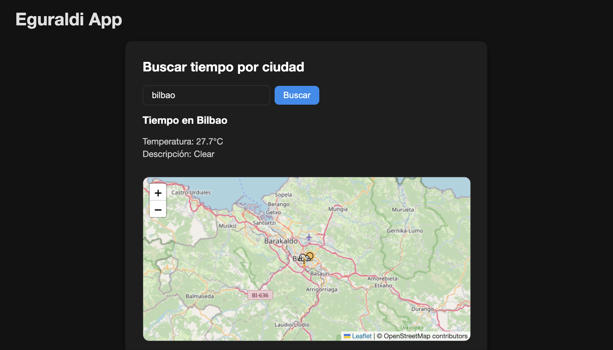

# eguraldi-app

Aplicación web para consultar el clima de cualquier ciudad y mostrar la información en un mapa interactivo.

---

## Descripción

Esta aplicación permite buscar el estado del tiempo de una ciudad usando la API de OpenWeatherMap y mostrar la información en un mapa con Leaflet. También permite hacer clic en el mapa para obtener el clima de la ubicación seleccionada.

---

## Demo

[Prueba la app](https://eguraldi-app.vercel.app)

## 🖼️ Vista previa



## Funcionalidades

- Buscar clima por ciudad.
- Mostrar temperatura y descripción del clima.
- Visualizar ubicación en un mapa con marcador personalizado.
- Actualizar el mapa al buscar una nueva ciudad.
- Hacer clic en el mapa para obtener el clima en esa ubicación.

---

## Tecnologías usadas

- Backend: Node.js, Express, Axios
- Frontend: React, React-Leaflet, Leaflet
- Otras: dotenv para variables de entorno, cors

---

## Instalación y uso

1. Clonar el repositorio:

```bash
git clone https://github.com/tu-usuario/weather-app.git
cd weather-app
```

2. Configurar variables de entorno en el archivo .env (tanto backend como frontend si es necesario):

```bash
PORT=3100
OPENWATHER_KEY=tu_api_key_openweather
```

3. Instalar dependencias en backend y frontend:

```bash
# Backend
cd backend
npm install

# Frontend
cd ../frontend
npm install

```

4. Iniciar servidor backend:

```bash
cd ../backend
npm run dev (nodemon)

```

5. Iniciar servidor frontend (desde la carpeta frontend):

```bash
npm run dev

```

6. Abrir en el navegador:

```bash
http://localhost:5174
```
